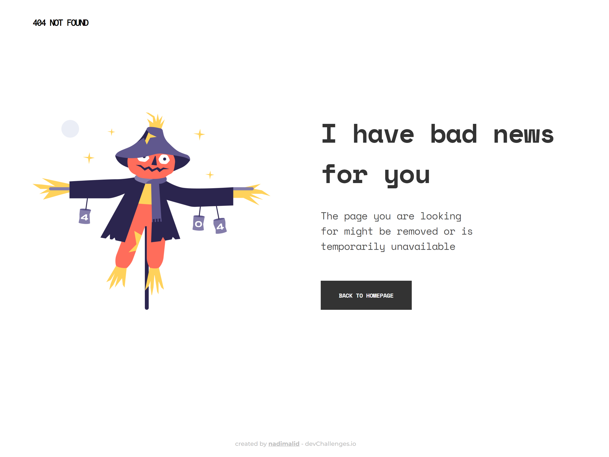

<!-- Please update value in the {}  -->

<h1 align="center">404 Not found page</h1>

   Solution for a challenge from  <a href="http://devchallenges.io" target="_blank">Devchallenges.io</a>.

  <h3>
    <a href="https://nadimalid.github.io/devchallenges-404-page">
      Demo
    </a>
     | 
    <a href="https://github.com/nadimalid/devchallenges-404-page">
      Solution
    </a>
     | 
    <a href="https://devchallenges.io/challenges/wBunSb7FPrIepJZAg0sY">
      Challenge
    </a>
  </h3>

<!-- TABLE OF CONTENTS -->

## Table of Contents

- [Table of Contents](#table-of-contents)
- [Overview](#overview)
  - [Built With](#built-with)
- [Features](#features)
- [Contact](#contact)

<!-- OVERVIEW -->

## Overview

### Built With

- Flexbox
- Mobile-first approach

<!-- FEATURES -->

## Features

This application/site was created as a submission to a [DevChallenges](https://devchallenges.io/challenges) challenge. The [challenge](https://devchallenges.io/challenges/wBunSb7FPrIepJZAg0sY) was to build an application to complete the given user stories.

<!-- CONTACT -->

## Contact

- GitHub [@nadimalid](https://github.com/nadimalid)
